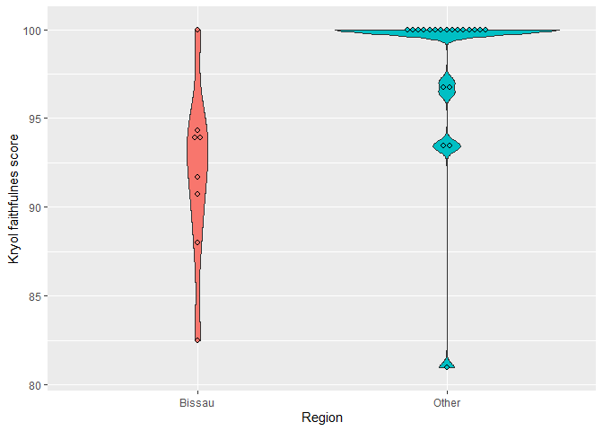
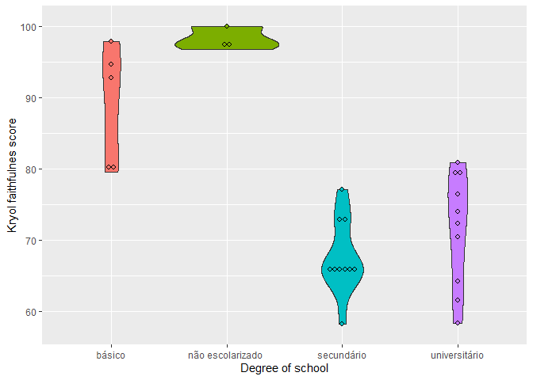
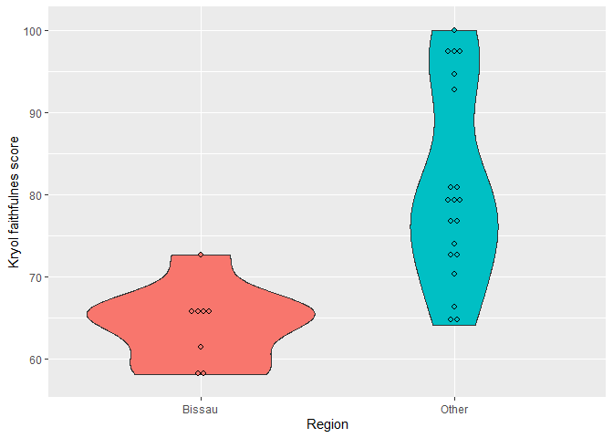

Supplementary materials for: Internal variation in Guinea-Bissau Kriyol:
phonological and sociolinguistic aspects
================
Ronaldo Mendes and Carlos Silva
(30 outubro, 2023)

- [1 Data](#1-data)
- [2 Onset](#2-onset)
  - [2.1 v_b](#21-v_b)
  - [2.2 z_s](#22-z_s)
  - [2.3 ʒ_dʒ](#23-ʒ_dʒ)
  - [2.4 ʃ_tʃ](#24-ʃ_tʃ)
  - [2.5 λ_dʒ](#25-λ_dʒ)
- [3 Coda](#3-coda)
  - [3.1 ʒ_s](#31-ʒ_s)
  - [3.2 ʒ_Ø](#32-ʒ_ø)
  - [3.3 ʃ_s](#33-ʃ_s)
- [4 Global results (Onset + coda)](#4-global-results-onset--coda)
- [5 Partial results (onset only)](#5-partial-results-onset-only)

\#Packages

``` r
library(tidyverse)
```

    ## ── Attaching core tidyverse packages ──────────────────────── tidyverse 2.0.0 ──
    ## ✔ dplyr     1.1.2     ✔ readr     2.1.4
    ## ✔ forcats   1.0.0     ✔ stringr   1.5.0
    ## ✔ ggplot2   3.4.2     ✔ tibble    3.2.1
    ## ✔ lubridate 1.9.2     ✔ tidyr     1.3.0
    ## ✔ purrr     1.0.1     
    ## ── Conflicts ────────────────────────────────────────── tidyverse_conflicts() ──
    ## ✖ dplyr::filter() masks stats::filter()
    ## ✖ dplyr::lag()    masks stats::lag()
    ## ℹ Use the conflicted package (<http://conflicted.r-lib.org/>) to force all conflicts to become errors

# 1 Data

``` r
df <- read.csv("GuineaBissau_Ronaldo_full.csv")
```

# 2 Onset

## 2.1 v_b

``` r
ggplot(df, aes(x = place_simple, y = v_b, 
                             fill = place_simple)) +
  geom_smooth(method = "lm") +
  geom_violin() +
  geom_dotplot(binaxis = "y",
               stackdir = "center",
               dotsize = 0.5)  +
  theme(legend.position="none") +
  labs(y = "Kryol faithfulnes score", x = "Region")
```

    ## `geom_smooth()` using formula = 'y ~ x'
    ## Bin width defaults to 1/30 of the range of the data. Pick better value with
    ## `binwidth`.

<!-- -->

``` r
ggplot(df, aes(x = school, y = v_b, 
               fill = school)) +
  geom_smooth(method = "lm") +
  geom_violin() +
  geom_dotplot(binaxis = "y",
               stackdir = "center",
               dotsize = 0.5)  +
  theme(legend.position="none") +
  labs(y = "Kryol faithfulnes score", x = "Degree of school")
```

    ## `geom_smooth()` using formula = 'y ~ x'
    ## Bin width defaults to 1/30 of the range of the data. Pick better value with
    ## `binwidth`.

<!-- -->

``` r
ggplot(df, aes(x = mother_tongue, y = v_b, 
               fill = mother_tongue)) +
  geom_smooth(method = "lm") +
  geom_violin() +
  geom_dotplot(binaxis = "y",
               stackdir = "center",
               dotsize = 0.5)  +
  theme(legend.position="none") +
  labs(y = "Kryol faithfulnes score", x = "Mother tongue")
```

    ## `geom_smooth()` using formula = 'y ~ x'

    ## Warning: Groups with fewer than two data points have been dropped.
    ## Groups with fewer than two data points have been dropped.
    ## Groups with fewer than two data points have been dropped.
    ## Groups with fewer than two data points have been dropped.
    ## Groups with fewer than two data points have been dropped.
    ## Groups with fewer than two data points have been dropped.

    ## Bin width defaults to 1/30 of the range of the data. Pick better value with
    ## `binwidth`.

<!-- -->

``` r
ggplot(df, aes(x = age, y = v_b, label = ID)) +
  geom_smooth(method = "lm") +
  geom_point()  +
  geom_text(aes(label=ID), hjust=3, vjust=0)
```

    ## `geom_smooth()` using formula = 'y ~ x'

    ## Warning: The following aesthetics were dropped during statistical transformation: label
    ## ℹ This can happen when ggplot fails to infer the correct grouping structure in
    ##   the data.
    ## ℹ Did you forget to specify a `group` aesthetic or to convert a numerical
    ##   variable into a factor?

<!-- -->

## 2.2 z_s

``` r
ggplot(df, aes(x = place_simple, y = z_s, 
               fill = place_simple)) +
  geom_smooth(method = "lm") +
  geom_violin() +
  geom_dotplot(binaxis = "y",
               stackdir = "center",
               dotsize = 0.5)  +
  theme(legend.position="none") +
  labs(y = "Kryol faithfulnes score", x = "Region")
```

    ## `geom_smooth()` using formula = 'y ~ x'
    ## Bin width defaults to 1/30 of the range of the data. Pick better value with
    ## `binwidth`.

<!-- -->

``` r
ggplot(df, aes(x = school, y = z_s, 
               fill = school)) +
  geom_smooth(method = "lm") +
  geom_violin() +
  geom_dotplot(binaxis = "y",
               stackdir = "center",
               dotsize = 0.5)  +
  theme(legend.position="none") +
  labs(y = "Kryol faithfulnes score", x = "Degree of school")
```

    ## `geom_smooth()` using formula = 'y ~ x'
    ## Bin width defaults to 1/30 of the range of the data. Pick better value with
    ## `binwidth`.

<!-- -->

``` r
ggplot(df, aes(x = mother_tongue, y = z_s, 
               fill = mother_tongue)) +
  geom_smooth(method = "lm") +
  geom_violin() +
  geom_dotplot(binaxis = "y",
               stackdir = "center",
               dotsize = 0.5)  +
  theme(legend.position="none") +
  labs(y = "Kryol faithfulnes score", x = "Mother tongue")
```

    ## `geom_smooth()` using formula = 'y ~ x'

    ## Warning: Groups with fewer than two data points have been dropped.
    ## Groups with fewer than two data points have been dropped.
    ## Groups with fewer than two data points have been dropped.
    ## Groups with fewer than two data points have been dropped.
    ## Groups with fewer than two data points have been dropped.
    ## Groups with fewer than two data points have been dropped.

    ## Bin width defaults to 1/30 of the range of the data. Pick better value with
    ## `binwidth`.

<!-- -->

``` r
ggplot(df, aes(x = age, y = z_s, label = ID)) +
  geom_smooth(method = "lm") +
  geom_point()  +
  geom_text(aes(label=ID), hjust=3, vjust=0)
```

    ## `geom_smooth()` using formula = 'y ~ x'

    ## Warning: The following aesthetics were dropped during statistical transformation: label
    ## ℹ This can happen when ggplot fails to infer the correct grouping structure in
    ##   the data.
    ## ℹ Did you forget to specify a `group` aesthetic or to convert a numerical
    ##   variable into a factor?

<!-- -->

## 2.3 ʒ_dʒ

``` r
ggplot(df, aes(x = place_simple, y = palfricvoz_palafrvoz, 
               fill = place_simple)) +
  geom_smooth(method = "lm") +
  geom_violin() +
  geom_dotplot(binaxis = "y",
               stackdir = "center",
               dotsize = 0.5)  +
  theme(legend.position="none") +
  labs(y = "Kryol faithfulnes score", x = "Region")
```

    ## `geom_smooth()` using formula = 'y ~ x'
    ## Bin width defaults to 1/30 of the range of the data. Pick better value with
    ## `binwidth`.

<!-- -->

``` r
ggplot(df, aes(x = school, y = palfricvoz_palafrvoz, 
               fill = school)) +
  geom_smooth(method = "lm") +
  geom_violin() +
  geom_dotplot(binaxis = "y",
               stackdir = "center",
               dotsize = 0.5)  +
  theme(legend.position="none") +
  labs(y = "Kryol faithfulnes score", x = "Degree of school")
```

    ## `geom_smooth()` using formula = 'y ~ x'
    ## Bin width defaults to 1/30 of the range of the data. Pick better value with
    ## `binwidth`.

<!-- -->

``` r
ggplot(df, aes(x = mother_tongue, y = palfricvoz_palafrvoz, 
               fill = mother_tongue)) +
  geom_smooth(method = "lm") +
  geom_violin() +
  geom_dotplot(binaxis = "y",
               stackdir = "center",
               dotsize = 0.5)  +
  theme(legend.position="none") +
  labs(y = "Kryol faithfulnes score", x = "Mother tongue")
```

    ## `geom_smooth()` using formula = 'y ~ x'

    ## Warning: Groups with fewer than two data points have been dropped.
    ## Groups with fewer than two data points have been dropped.
    ## Groups with fewer than two data points have been dropped.
    ## Groups with fewer than two data points have been dropped.
    ## Groups with fewer than two data points have been dropped.
    ## Groups with fewer than two data points have been dropped.

    ## Bin width defaults to 1/30 of the range of the data. Pick better value with
    ## `binwidth`.

<!-- -->

``` r
ggplot(df, aes(x = age, y = palfricvoz_palafrvoz, label = ID)) +
  geom_smooth(method = "lm") +
  geom_point()  +
  geom_text(aes(label=ID), hjust=3, vjust=0)
```

    ## `geom_smooth()` using formula = 'y ~ x'

    ## Warning: The following aesthetics were dropped during statistical transformation: label
    ## ℹ This can happen when ggplot fails to infer the correct grouping structure in
    ##   the data.
    ## ℹ Did you forget to specify a `group` aesthetic or to convert a numerical
    ##   variable into a factor?

<!-- -->

## 2.4 ʃ_tʃ

``` r
ggplot(df, aes(x = place_simple, y = palfricsur_palafrsur, 
               fill = place_simple)) +
  geom_smooth(method = "lm") +
  geom_violin() +
  geom_dotplot(binaxis = "y",
               stackdir = "center",
               dotsize = 0.5)  +
  theme(legend.position="none") +
  labs(y = "Kryol faithfulnes score", x = "Region")
```

    ## `geom_smooth()` using formula = 'y ~ x'
    ## Bin width defaults to 1/30 of the range of the data. Pick better value with
    ## `binwidth`.

<!-- -->

``` r
ggplot(df, aes(x = school, y = palfricsur_palafrsur, 
               fill = school)) +
  geom_smooth(method = "lm") +
  geom_violin() +
  geom_dotplot(binaxis = "y",
               stackdir = "center",
               dotsize = 0.5)  +
  theme(legend.position="none") +
  labs(y = "Kryol faithfulnes score", x = "Degree of school")
```

    ## `geom_smooth()` using formula = 'y ~ x'
    ## Bin width defaults to 1/30 of the range of the data. Pick better value with
    ## `binwidth`.

<!-- -->

``` r
ggplot(df, aes(x = mother_tongue, y = palfricsur_palafrsur, 
               fill = mother_tongue)) +
  geom_smooth(method = "lm") +
  geom_violin() +
  geom_dotplot(binaxis = "y",
               stackdir = "center",
               dotsize = 0.5)  +
  theme(legend.position="none") +
  labs(y = "Kryol faithfulnes score", x = "Mother tongue")
```

    ## `geom_smooth()` using formula = 'y ~ x'

    ## Warning: Groups with fewer than two data points have been dropped.
    ## Groups with fewer than two data points have been dropped.
    ## Groups with fewer than two data points have been dropped.
    ## Groups with fewer than two data points have been dropped.
    ## Groups with fewer than two data points have been dropped.
    ## Groups with fewer than two data points have been dropped.

    ## Bin width defaults to 1/30 of the range of the data. Pick better value with
    ## `binwidth`.

<!-- -->

``` r
ggplot(df, aes(x = age, y = palfricsur_palafrsur, label = ID)) +
  geom_smooth(method = "lm") +
  geom_point()  +
  geom_text(aes(label=ID), hjust=3, vjust=0)
```

    ## `geom_smooth()` using formula = 'y ~ x'

    ## Warning: The following aesthetics were dropped during statistical transformation: label
    ## ℹ This can happen when ggplot fails to infer the correct grouping structure in
    ##   the data.
    ## ℹ Did you forget to specify a `group` aesthetic or to convert a numerical
    ##   variable into a factor?

<!-- -->

## 2.5 λ_dʒ

``` r
ggplot(df, aes(x = place_simple, y = pallat_palafrvoz, 
               fill = place_simple)) +
  geom_smooth(method = "lm") +
  geom_violin() +
  geom_dotplot(binaxis = "y",
               stackdir = "center",
               dotsize = 0.5)  +
  theme(legend.position="none") +
  labs(y = "Kryol faithfulnes score", x = "Region")
```

    ## `geom_smooth()` using formula = 'y ~ x'
    ## Bin width defaults to 1/30 of the range of the data. Pick better value with
    ## `binwidth`.

<!-- -->

``` r
ggplot(df, aes(x = school, y = pallat_palafrvoz, 
               fill = school)) +
  geom_smooth(method = "lm") +
  geom_violin() +
  geom_dotplot(binaxis = "y",
               stackdir = "center",
               dotsize = 0.5)  +
  theme(legend.position="none") +
  labs(y = "Kryol faithfulnes score", x = "Degree of school")
```

    ## `geom_smooth()` using formula = 'y ~ x'
    ## Bin width defaults to 1/30 of the range of the data. Pick better value with
    ## `binwidth`.

<!-- -->

``` r
ggplot(df, aes(x = mother_tongue, y = pallat_palafrvoz, 
               fill = mother_tongue)) +
  geom_smooth(method = "lm") +
  geom_violin() +
  geom_dotplot(binaxis = "y",
               stackdir = "center",
               dotsize = 0.5)  +
  theme(legend.position="none") +
  labs(y = "Kryol faithfulnes score", x = "Mother tongue")
```

    ## `geom_smooth()` using formula = 'y ~ x'

    ## Warning: Groups with fewer than two data points have been dropped.
    ## Groups with fewer than two data points have been dropped.
    ## Groups with fewer than two data points have been dropped.
    ## Groups with fewer than two data points have been dropped.
    ## Groups with fewer than two data points have been dropped.
    ## Groups with fewer than two data points have been dropped.

    ## Bin width defaults to 1/30 of the range of the data. Pick better value with
    ## `binwidth`.

<!-- -->

``` r
ggplot(df, aes(x = age, y = pallat_palafrvoz, label = ID)) +
  geom_smooth(method = "lm") +
  geom_point()  +
  geom_text(aes(label=ID), hjust=3, vjust=0)
```

    ## `geom_smooth()` using formula = 'y ~ x'

    ## Warning: The following aesthetics were dropped during statistical transformation: label
    ## ℹ This can happen when ggplot fails to infer the correct grouping structure in
    ##   the data.
    ## ℹ Did you forget to specify a `group` aesthetic or to convert a numerical
    ##   variable into a factor?

<!-- -->

# 3 Coda

## 3.1 ʒ_s

``` r
ggplot(df, aes(x = place_simple, y = palfricvoz_s, 
               fill = place_simple)) +
  geom_smooth(method = "lm") +
  geom_violin() +
  geom_dotplot(binaxis = "y",
               stackdir = "center",
               dotsize = 0.5)  +
  theme(legend.position="none") +
  labs(y = "Kryol faithfulnes score", x = "Region")
```

    ## `geom_smooth()` using formula = 'y ~ x'
    ## Bin width defaults to 1/30 of the range of the data. Pick better value with
    ## `binwidth`.

<!-- -->

``` r
ggplot(df, aes(x = school, y = palfricvoz_s, 
               fill = school)) +
  geom_smooth(method = "lm") +
  geom_violin() +
  geom_dotplot(binaxis = "y",
               stackdir = "center",
               dotsize = 0.5)  +
  theme(legend.position="none") +
  labs(y = "Kryol faithfulnes score", x = "Degree of school")
```

    ## `geom_smooth()` using formula = 'y ~ x'
    ## Bin width defaults to 1/30 of the range of the data. Pick better value with
    ## `binwidth`.

<!-- -->

``` r
ggplot(df, aes(x = mother_tongue, y = palfricvoz_s, 
               fill = mother_tongue)) +
  geom_smooth(method = "lm") +
  geom_violin() +
  geom_dotplot(binaxis = "y",
               stackdir = "center",
               dotsize = 0.5)  +
  theme(legend.position="none") +
  labs(y = "Kryol faithfulnes score", x = "Mother tongue")
```

    ## `geom_smooth()` using formula = 'y ~ x'

    ## Warning: Groups with fewer than two data points have been dropped.
    ## Groups with fewer than two data points have been dropped.
    ## Groups with fewer than two data points have been dropped.
    ## Groups with fewer than two data points have been dropped.
    ## Groups with fewer than two data points have been dropped.
    ## Groups with fewer than two data points have been dropped.

    ## Bin width defaults to 1/30 of the range of the data. Pick better value with
    ## `binwidth`.

<!-- -->

``` r
ggplot(df, aes(x = age, y = palfricvoz_s, label = ID)) +
  geom_smooth(method = "lm") +
  geom_point()  +
  geom_text(aes(label=ID), hjust=3, vjust=0)
```

    ## `geom_smooth()` using formula = 'y ~ x'

    ## Warning: The following aesthetics were dropped during statistical transformation: label
    ## ℹ This can happen when ggplot fails to infer the correct grouping structure in
    ##   the data.
    ## ℹ Did you forget to specify a `group` aesthetic or to convert a numerical
    ##   variable into a factor?

<!-- -->

## 3.2 ʒ_Ø

``` r
ggplot(df, aes(x = place_simple, y = palfricvoz_zero, 
               fill = place_simple)) +
  geom_smooth(method = "lm") +
  geom_violin() +
  geom_dotplot(binaxis = "y",
               stackdir = "center",
               dotsize = 0.5)  +
  theme(legend.position="none") +
  labs(y = "Kryol faithfulnes score", x = "Region")
```

    ## `geom_smooth()` using formula = 'y ~ x'
    ## Bin width defaults to 1/30 of the range of the data. Pick better value with
    ## `binwidth`.

<!-- -->

``` r
ggplot(df, aes(x = school, y = palfricvoz_zero, 
               fill = school)) +
  geom_smooth(method = "lm") +
  geom_violin() +
  geom_dotplot(binaxis = "y",
               stackdir = "center",
               dotsize = 0.5)  +
  theme(legend.position="none") +
  labs(y = "Kryol faithfulnes score", x = "Degree of school")
```

    ## `geom_smooth()` using formula = 'y ~ x'
    ## Bin width defaults to 1/30 of the range of the data. Pick better value with
    ## `binwidth`.

<!-- -->

``` r
ggplot(df, aes(x = mother_tongue, y = palfricvoz_zero, 
               fill = mother_tongue)) +
  geom_smooth(method = "lm") +
  geom_violin() +
  geom_dotplot(binaxis = "y",
               stackdir = "center",
               dotsize = 0.5)  +
  theme(legend.position="none") +
  labs(y = "Kryol faithfulnes score", x = "Mother tongue")
```

    ## `geom_smooth()` using formula = 'y ~ x'

    ## Warning: Groups with fewer than two data points have been dropped.
    ## Groups with fewer than two data points have been dropped.
    ## Groups with fewer than two data points have been dropped.
    ## Groups with fewer than two data points have been dropped.
    ## Groups with fewer than two data points have been dropped.
    ## Groups with fewer than two data points have been dropped.

    ## Bin width defaults to 1/30 of the range of the data. Pick better value with
    ## `binwidth`.

<!-- -->

``` r
ggplot(df, aes(x = age, y = palfricvoz_zero, label = ID)) +
  geom_smooth(method = "lm") +
  geom_point()  +
  geom_text(aes(label=ID), hjust=3, vjust=0)
```

    ## `geom_smooth()` using formula = 'y ~ x'

    ## Warning: The following aesthetics were dropped during statistical transformation: label
    ## ℹ This can happen when ggplot fails to infer the correct grouping structure in
    ##   the data.
    ## ℹ Did you forget to specify a `group` aesthetic or to convert a numerical
    ##   variable into a factor?

<!-- -->

## 3.3 ʃ_s

``` r
ggplot(df, aes(x = place_simple, y = palfricsur_s, 
               fill = place_simple)) +
  geom_smooth(method = "lm") +
  geom_violin() +
  geom_dotplot(binaxis = "y",
               stackdir = "center",
               dotsize = 0.5)  +
  theme(legend.position="none") +
  labs(y = "Kryol faithfulnes score", x = "Region")
```

    ## `geom_smooth()` using formula = 'y ~ x'
    ## Bin width defaults to 1/30 of the range of the data. Pick better value with
    ## `binwidth`.

<!-- -->

``` r
ggplot(df, aes(x = school, y = palfricsur_s, 
               fill = school)) +
  geom_smooth(method = "lm") +
  geom_violin() +
  geom_dotplot(binaxis = "y",
               stackdir = "center",
               dotsize = 0.5)  +
  theme(legend.position="none") +
  labs(y = "Kryol faithfulnes score", x = "Degree of school")
```

    ## `geom_smooth()` using formula = 'y ~ x'
    ## Bin width defaults to 1/30 of the range of the data. Pick better value with
    ## `binwidth`.

<!-- -->

``` r
ggplot(df, aes(x = mother_tongue, y = palfricsur_s, 
               fill = mother_tongue)) +
  geom_smooth(method = "lm") +
  geom_violin() +
  geom_dotplot(binaxis = "y",
               stackdir = "center",
               dotsize = 0.5)  +
  theme(legend.position="none") +
  labs(y = "Kryol faithfulnes score", x = "Mother tongue")
```

    ## `geom_smooth()` using formula = 'y ~ x'

    ## Warning: Groups with fewer than two data points have been dropped.
    ## Groups with fewer than two data points have been dropped.
    ## Groups with fewer than two data points have been dropped.
    ## Groups with fewer than two data points have been dropped.
    ## Groups with fewer than two data points have been dropped.
    ## Groups with fewer than two data points have been dropped.

    ## Bin width defaults to 1/30 of the range of the data. Pick better value with
    ## `binwidth`.

<!-- -->

``` r
ggplot(df, aes(x = age, y = palfricsur_s, label = ID)) +
  geom_smooth(method = "lm") +
  geom_point()  +
  geom_text(aes(label=ID), hjust=3, vjust=0)
```

    ## `geom_smooth()` using formula = 'y ~ x'

    ## Warning: The following aesthetics were dropped during statistical transformation: label
    ## ℹ This can happen when ggplot fails to infer the correct grouping structure in
    ##   the data.
    ## ℹ Did you forget to specify a `group` aesthetic or to convert a numerical
    ##   variable into a factor?

<!-- -->

# 4 Global results (Onset + coda)

``` r
ggplot(df, aes(x = school, y = global, 
               fill = school)) +
  geom_smooth(method = "lm") +
  geom_violin() +
  geom_dotplot(binaxis = "y",
               stackdir = "center",
               dotsize = 0.5)  +
  theme(legend.position="none") +
  labs(y = "Kryol faithfulnes score", x = "Degree of school")
```

    ## `geom_smooth()` using formula = 'y ~ x'
    ## Bin width defaults to 1/30 of the range of the data. Pick better value with
    ## `binwidth`.

<!-- -->

``` r
ggplot(df, aes(x = place_simple, y = global, 
               fill = place_simple)) +
  geom_smooth(method = "lm") +
  geom_violin() +
  geom_dotplot(binaxis = "y",
               stackdir = "center",
               dotsize = 0.5)  +
  theme(legend.position="none") +
  labs(y = "Kryol faithfulnes score", x = "Region")
```

    ## `geom_smooth()` using formula = 'y ~ x'
    ## Bin width defaults to 1/30 of the range of the data. Pick better value with
    ## `binwidth`.

<!-- -->

``` r
ggplot(df, aes(x = sex, y = global, 
               fill = sex)) +
  geom_smooth(method = "lm") +
  geom_violin() +
  geom_dotplot(binaxis = "y",
               stackdir = "center",
               dotsize = 0.5)  +
  theme(legend.position="none") +
  labs(y = "Kryol faithfulnes score", x = "Sex")
```

    ## `geom_smooth()` using formula = 'y ~ x'
    ## Bin width defaults to 1/30 of the range of the data. Pick better value with
    ## `binwidth`.

<!-- -->

``` r
ggplot(df, aes(x = variant, y = global, 
               fill = variant)) +
  geom_smooth(method = "lm") +
  geom_violin() +
  geom_dotplot(binaxis = "y",
               stackdir = "center",
               dotsize = 0.5)  +
  theme(legend.position="none") +
  labs(y = "Kryol faithfulnes score", x = "Variant")
```

    ## `geom_smooth()` using formula = 'y ~ x'
    ## Bin width defaults to 1/30 of the range of the data. Pick better value with
    ## `binwidth`.

<!-- -->

``` r
ggplot(df, aes(x = mother_tongue, y = global, 
               fill = mother_tongue)) +
  geom_smooth(method = "lm") +
  geom_violin() +
  geom_dotplot(binaxis = "y",
               stackdir = "center",
               dotsize = 0.5)  +
  theme(legend.position="none") +
  labs(y = "Kryol faithfulnes score", x = "Mother tongue")
```

    ## `geom_smooth()` using formula = 'y ~ x'

    ## Warning: Groups with fewer than two data points have been dropped.
    ## Groups with fewer than two data points have been dropped.
    ## Groups with fewer than two data points have been dropped.
    ## Groups with fewer than two data points have been dropped.
    ## Groups with fewer than two data points have been dropped.
    ## Groups with fewer than two data points have been dropped.

    ## Bin width defaults to 1/30 of the range of the data. Pick better value with
    ## `binwidth`.

<!-- -->

``` r
ggplot(df, aes(x = kryol_acquisition, y = global, 
               fill = kryol_acquisition)) +
  geom_smooth(method = "lm") +
  geom_violin() +
  geom_dotplot(binaxis = "y",
               stackdir = "center",
               dotsize = 0.5)  +
  theme(legend.position="none") +
  labs(y = "Kryol faithfulnes score", x = "Region")
```

    ## `geom_smooth()` using formula = 'y ~ x'

    ## Warning: Groups with fewer than two data points have been dropped.
    ## Groups with fewer than two data points have been dropped.

    ## Bin width defaults to 1/30 of the range of the data. Pick better value with
    ## `binwidth`.

<!-- -->

``` r
ggplot(df, aes(x = age, y = global, label = ID)) +
  geom_smooth(method = "lm") +
  geom_point()  +
  geom_text(aes(label=ID), hjust=3, vjust=0)
```

    ## `geom_smooth()` using formula = 'y ~ x'

    ## Warning: The following aesthetics were dropped during statistical transformation: label
    ## ℹ This can happen when ggplot fails to infer the correct grouping structure in
    ##   the data.
    ## ℹ Did you forget to specify a `group` aesthetic or to convert a numerical
    ##   variable into a factor?

<!-- -->

``` r
ggplot(df, aes(x = age, y = global, label = ID, color=sex)) +
 geom_smooth(method = "lm") +
  geom_point()  +
  geom_text(aes(label=ID), hjust=3, vjust=0)
```

    ## `geom_smooth()` using formula = 'y ~ x'

    ## Warning: The following aesthetics were dropped during statistical transformation: label
    ## ℹ This can happen when ggplot fails to infer the correct grouping structure in
    ##   the data.
    ## ℹ Did you forget to specify a `group` aesthetic or to convert a numerical
    ##   variable into a factor?

<!-- -->

# 5 Partial results (onset only)

``` r
ggplot(df, aes(x = school, y = partial, 
               fill = school)) +
  geom_smooth(method = "lm") +
  geom_violin() +
  geom_dotplot(binaxis = "y",
               stackdir = "center",
               dotsize = 0.5)  +
  theme(legend.position="none") +
  labs(y = "Kryol faithfulnes score", x = "Degree of school")
```

    ## `geom_smooth()` using formula = 'y ~ x'
    ## Bin width defaults to 1/30 of the range of the data. Pick better value with
    ## `binwidth`.

<!-- -->

``` r
ggplot(df, aes(x = place_simple, y = partial, 
               fill = place_simple)) +
  geom_smooth(method = "lm") +
  geom_violin() +
  geom_dotplot(binaxis = "y",
               stackdir = "center",
               dotsize = 0.5)  +
  theme(legend.position="none") +
  labs(y = "Kryol faithfulnes score", x = "Region")
```

    ## `geom_smooth()` using formula = 'y ~ x'
    ## Bin width defaults to 1/30 of the range of the data. Pick better value with
    ## `binwidth`.

<!-- -->

``` r
ggplot(df, aes(x = sex, y = partial, 
               fill = sex)) +
  geom_smooth(method = "lm") +
  geom_violin() +
  geom_dotplot(binaxis = "y",
               stackdir = "center",
               dotsize = 0.5)  +
  theme(legend.position="none") +
  labs(y = "Kryol faithfulnes score", x = "Sex")
```

    ## `geom_smooth()` using formula = 'y ~ x'
    ## Bin width defaults to 1/30 of the range of the data. Pick better value with
    ## `binwidth`.

<!-- -->

``` r
ggplot(df, aes(x = variant, y = partial, 
               fill = variant)) +
  geom_smooth(method = "lm") +
  geom_violin() +
  geom_dotplot(binaxis = "y",
               stackdir = "center",
               dotsize = 0.5)  +
  theme(legend.position="none") +
  labs(y = "Kryol faithfulnes score", x = "Variant")
```

    ## `geom_smooth()` using formula = 'y ~ x'
    ## Bin width defaults to 1/30 of the range of the data. Pick better value with
    ## `binwidth`.

<!-- -->

``` r
ggplot(df, aes(x = mother_tongue, y = partial, 
               fill = mother_tongue)) +
  geom_smooth(method = "lm") +
  geom_violin() +
  geom_dotplot(binaxis = "y",
               stackdir = "center",
               dotsize = 0.5)  +
  theme(legend.position="none") +
  labs(y = "Kryol faithfulnes score", x = "Mother tongue")
```

    ## `geom_smooth()` using formula = 'y ~ x'

    ## Warning: Groups with fewer than two data points have been dropped.
    ## Groups with fewer than two data points have been dropped.
    ## Groups with fewer than two data points have been dropped.
    ## Groups with fewer than two data points have been dropped.
    ## Groups with fewer than two data points have been dropped.
    ## Groups with fewer than two data points have been dropped.

    ## Bin width defaults to 1/30 of the range of the data. Pick better value with
    ## `binwidth`.

<!-- -->

``` r
ggplot(df, aes(x = kryol_acquisition, y = partial, 
               fill = kryol_acquisition)) +
  geom_smooth(method = "lm") +
  geom_violin() +
  geom_dotplot(binaxis = "y",
               stackdir = "center",
               dotsize = 0.5)  +
  theme(legend.position="none") +
  labs(y = "Kryol faithfulnes score", x = "Region")
```

    ## `geom_smooth()` using formula = 'y ~ x'

    ## Warning: Groups with fewer than two data points have been dropped.
    ## Groups with fewer than two data points have been dropped.

    ## Bin width defaults to 1/30 of the range of the data. Pick better value with
    ## `binwidth`.

<!-- -->

``` r
ggplot(df, aes(x = age, y = partial, label = ID)) +
  geom_smooth(method = "lm") +
  geom_point()  +
  geom_text(aes(label=ID), hjust=3, vjust=0)
```

    ## `geom_smooth()` using formula = 'y ~ x'

    ## Warning: The following aesthetics were dropped during statistical transformation: label
    ## ℹ This can happen when ggplot fails to infer the correct grouping structure in
    ##   the data.
    ## ℹ Did you forget to specify a `group` aesthetic or to convert a numerical
    ##   variable into a factor?

<!-- -->

``` r
ggplot(df, aes(x = age, y = partial, label = ID, color=sex)) +
  geom_smooth(method = "lm") +
  geom_point()  +
  geom_text(aes(label=ID), hjust=3, vjust=0)
```

    ## `geom_smooth()` using formula = 'y ~ x'

    ## Warning: The following aesthetics were dropped during statistical transformation: label
    ## ℹ This can happen when ggplot fails to infer the correct grouping structure in
    ##   the data.
    ## ℹ Did you forget to specify a `group` aesthetic or to convert a numerical
    ##   variable into a factor?

<!-- -->
